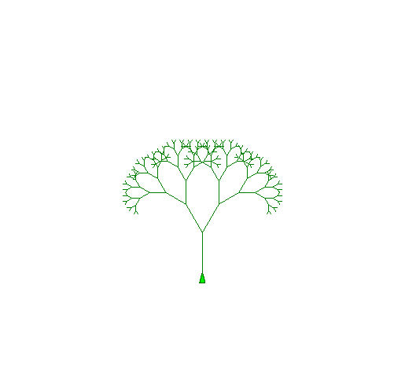
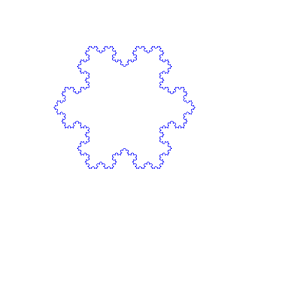
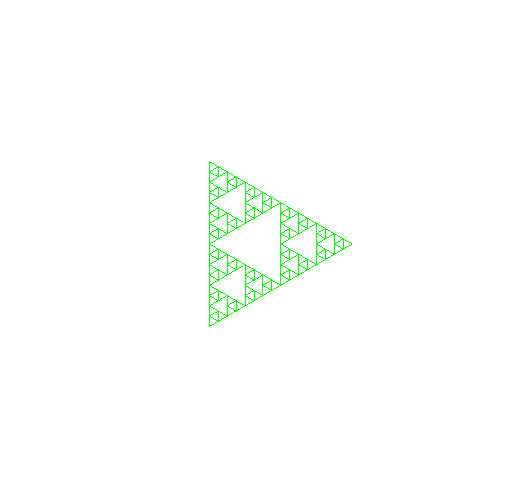

# Turtle Logo IDE

A Logo language interpreter and graphical development environment for Ubuntu Linux desktop, built with Python and tkinter.

![Layout: code editor on the left, turtle canvas on the right, console output below the editor]

---

## Requirements

| Requirement | Notes |
|---|---|
| Python 3.8+ | Standard on Ubuntu 20.04+ |
| `python3-tk` | `sudo apt install python3-tk` |
| `Pillow` | `pip install Pillow` — required for **Save Canvas as PNG** |

---

## Quick Start

```bash
cd ~/games/turtle
./run.sh
```

Or launch directly:

```bash
python3 logo_ide.py
```

`run.sh` will automatically install `python3-tk` if it is missing.

---

## Interface

```
+---------------------------+----------------------------------+
|  [ File ]  [ Edit ]  [ Run ]  [ Examples ]  [ Help ]        |
|  New  Open  Save  |  [ Run ]  [ Stop ]  Clear Canvas  Speed |
+---------------------------+----------------------------------+
```

**File menu** includes **Save Canvas as PNG…** (`Ctrl+Shift+P`) — exports the current canvas drawing as a PNG image file.

```
|  Editor                   |  Canvas                          |
|  (syntax highlighting,    |  (600x600 Logo coordinate space) |
|   line numbers, undo/redo)|                                  |
|                           |                                  |
+---------------------------+                                  |
|  Console Output           |                                  |
+---------------------------+----------------------------------+
```

**Keyboard shortcuts**

| Key | Action |
|-----|--------|
| `F5` | Run program |
| `F6` | Stop execution |
| `F7` | Clear canvas |
| `Ctrl+N` | New file |
| `Ctrl+O` | Open file |
| `Ctrl+S` | Save file |
| `Ctrl+Z` | Undo |
| `Ctrl+Shift+P` | Save canvas as PNG |

**Speed slider** — drag right to slow down execution and watch the turtle draw step by step.

---

## Logo Language Reference

### Turtle Motion

| Command | Alias | Description |
|---------|-------|-------------|
| `FORWARD n` | `FD n` | Move forward *n* steps |
| `BACKWARD n` | `BK n` | Move backward *n* steps |
| `RIGHT n` | `RT n` | Turn right *n* degrees |
| `LEFT n` | `LT n` | Turn left *n* degrees |
| `SETHEADING n` | `SETH n` | Set heading to *n* degrees (0 = North) |
| `HOME` | | Move to centre, heading 0 |
| `SETXY x y` | | Jump to coordinates *(x, y)* |
| `SETX x` | | Set x coordinate only |
| `SETY y` | | Set y coordinate only |
| `ARC angle radius` | | Draw arc of *angle* degrees at *radius* |

The canvas origin `(0, 0)` is the **centre** of the canvas.  
Positive y is **up**, positive x is **right**.  
Heading `0` points **north** (up); angles increase clockwise.

### Pen Control

| Command | Alias | Description |
|---------|-------|-------------|
| `PENUP` | `PU` | Lift pen (stop drawing) |
| `PENDOWN` | `PD` | Put pen down (resume drawing) |
| `PENSIZE n` | `SETPENSIZE n` | Set pen width to *n* pixels |
| `SETPENCOLOR c` | `SETPC c`, `PC c` | Set pen colour (see Colours below) |
| `SETFILLCOLOR c` | `SETFC c` | Set fill colour |
| `SETBACKGROUND c` | `SETBG c` | Set canvas background colour |

### Turtle Visibility

| Command | Alias | Description |
|---------|-------|-------------|
| `HIDETURTLE` | `HT` | Hide the turtle |
| `SHOWTURTLE` | `ST` | Show the turtle |

### Screen

| Command | Alias | Description |
|---------|-------|-------------|
| `CLEARSCREEN` | `CS` | Clear canvas and send turtle home |
| `CLEAN` | | Clear canvas, keep turtle position |

### Colours

Colours can be specified three ways:

1. **Number 0–255** — follows the standard xterm-256 palette:

   | Range | Contents |
   |-------|----------|
   | 0–15 | System colours (see table below) |
   | 16–231 | 6×6×6 RGB cube: `16 + 36*r + 6*g + b` (r/g/b each 0–5) |
   | 232–255 | 24-step greyscale ramp (dark → light) |

   **System colours 0–15:**

   | # | Colour | # | Colour |
   |---|--------|---|--------|
   | 0 | Black | 8 | Grey |
   | 1 | Navy | 9 | Blue |
   | 2 | Green | 10 | Lime |
   | 3 | Teal | 11 | Cyan |
   | 4 | Maroon | 12 | Red |
   | 5 | Purple | 13 | Magenta |
   | 6 | Olive | 14 | Yellow |
   | 7 | Silver | 15 | White |

2. **Named colour** — any Tk/X11 colour name: `"red`, `"dodgerblue`, `"coral`, etc.

   > **Note:** Logo uses a *leading* quote only — `"red` not `"red"`.  
   > The interpreter accepts trailing quotes and strips them automatically, but it is best practice to omit them.  
   > An unrecognised colour name (e.g. `"banana`) will stop execution and print an error in the console instead of crashing.

3. **RGB list** — `[r g b]` where each component is 0–255: `SETPENCOLOR [255 128 0]`

Examples:
```logo
SETPENCOLOR 12          ; red (system colour)
SETPENCOLOR 196         ; pure red from RGB cube
SETPENCOLOR "dodgerblue ; named colour
SETPENCOLOR [0 200 150] ; custom RGB
```

### Variables

```logo
MAKE "name value        ; assign  (e.g.  MAKE "x 10)
:name                   ; read    (e.g.  FORWARD :x)
LOCAL "name             ; declare procedure-local variable
LOCALMAKE "name value   ; declare and assign local variable
```

### Procedures

```logo
TO square :size
  REPEAT 4 [ FORWARD :size  RIGHT 90 ]
END

square 100
```

- `OUTPUT value` (or `OP value`) — return a value from a procedure  
- `STOP` — exit a procedure without returning a value  
- Procedures can call themselves recursively

### Control Flow

```logo
REPEAT n [ block ]

IF condition [ block ]
IFELSE condition [ true-block ] [ false-block ]

WHILE [ condition ] [ body ]
UNTIL [ condition ] [ body ]

FOR [ var start end ] [ body ]
FOR [ var start end step ] [ body ]

FOREVER [ block ]      ; runs until STOP or the Stop button
```

### Arithmetic & Math

Infix operators (spaces required): `+  -  *  /  =  <  >  <=  >=  <>`

> **Operator precedence tip:** A reporter like `SIN` consumes the *next expression* as its argument,
> which includes any trailing `*` or `/`.  Write `(SIN :x) * 200` — not `SIN :x * 200` — to
> multiply the result of SIN rather than its argument.

| Reporter | Description |
|----------|-------------|
| `SUM a b` | a + b |
| `DIFFERENCE a b` | a − b |
| `PRODUCT a b` | a × b |
| `QUOTIENT a b` | a ÷ b |
| `REMAINDER a b` | a mod b |
| `POWER a b` | a ^ b |
| `SQRT n` | square root |
| `ABS n` | absolute value |
| `INT n` | truncate to integer |
| `ROUND n` | round to nearest integer |
| `SIN n` / `COS n` / `TAN n` | trig (degrees) |
| `ARCTAN n` / `ARCSIN n` / `ARCCOS n` | inverse trig (degrees) |
| `MAX a b` / `MIN a b` | maximum / minimum |
| `RANDOM n` | random integer 0 to n−1 |
| `PI` | 3.14159… |

### Logic

```logo
AND a b     OR a b     NOT a
EQUAL? a b  LESS? a b  GREATER? a b
```

### Output

```logo
PRINT value    ; print value + newline  (alias: PR)
TYPE value     ; print value, no newline
SHOW value     ; same as PRINT
NEWLINE        ; print a blank line
```

### Turtle State Reporters

```logo
XCOR      ; current x coordinate
YCOR      ; current y coordinate
HEADING   ; current heading in degrees
PENDOWNP  ; TRUE if pen is down
```

### Type Predicates

```logo
NUMBER? v   WORD? v   LIST? v   EMPTY? v   ZERO? v
NEGATIVE? v  POSITIVE? v
```

### List & Word Operations

```logo
FIRST v         ; first element of list or character of word
LAST v          ; last element or character
BUTFIRST v      ; all but first  (alias: BF)
BUTLAST v       ; all but last   (alias: BL)
COUNT v         ; number of elements
ITEM n v        ; nth element (1-based)
MEMBER item v   ; sub-list/word starting at first occurrence
LIST a b        ; create two-element list
SENTENCE a b    ; join lists/words  (alias: SE)
FPUT item list  ; prepend item to list
LPUT item list  ; append item to list
WORD a b        ; concatenate as string
```

### Comments

```logo
; This is a comment — everything from ; to end of line is ignored
```

---

## Example Programs

The **Examples** menu includes eight built-in programs. Additional `.logo` files are in the `examples/` directory.

### Square (minimal example)
```logo
REPEAT 4 [
  FORWARD 100
  RIGHT 90
]
```

### Colourful Spiral
```logo
HIDETURTLE
FOR [i 1 80] [
  SETPENCOLOR :i * 3
  FORWARD :i * 2
  RIGHT 91
]
```

### Recursive Tree

```logo
TO TREE :size
  IF :size < 5 [ STOP ]
  FORWARD :size
  LEFT 30
  TREE :size * 0.7
  RIGHT 60
  TREE :size * 0.7
  LEFT 30
  BACKWARD :size
END

PENUP  SETY -150  PENDOWN
SETPENCOLOR "green
TREE 90
```

### Koch Snowflake (fractal)

```logo
TO KOCH :size :depth
  IF :depth = 0 [ FORWARD :size  STOP ]
  KOCH :size / 3 :depth - 1
  LEFT 60
  KOCH :size / 3 :depth - 1
  RIGHT 120
  KOCH :size / 3 :depth - 1
  LEFT 60
  KOCH :size / 3 :depth - 1
END

HIDETURTLE
PENUP  SETXY -140 60  PENDOWN
SETPENCOLOR "blue
REPEAT 3 [ KOCH 280 4  RIGHT 120 ]
```

---

## Example Files

The `examples/` directory contains 13 ready-to-run programs. Open any of them with **File > Open**.

| File | Description |
|------|-------------|
| `spiral.logo` | Expanding square spiral with a FOR loop |
| `snowflake.logo` | Koch snowflake, depth 4 (recursive) |
| `tree.logo` | Fractal binary tree (recursive branching) |
| `hilbert.logo` | Hilbert space-filling curve, depth 5 |
| `rose_of_stars.logo` | 72 overlapping five-pointed stars, all 256 palette colours |
| `web.logo` | Spider web — 8 spokes and 5 concentric octagonal rings |
| `sierpinski.logo` | Sierpinski triangle, depth 4  |
| `rainbow_spiral.logo` | Square spiral cycling through all 256 colours twice |
| `sunburst.logo` | 72 alternating-length rays with concentric ring overlays |
| `mandala.logo` | Three rings of ARC-drawn petals plus a centre disc |
| `lissajous.logo` | Three overlapping Lissajous curves (3:2, 5:4, 7:6 ratios) |
| `galaxy.logo` | Four logarithmic spiral arms on a black background |
| `dragon_curve.logo` | Dragon curve fractal via mutual recursion, depth 11 |

---

## File Format

Logo programs are plain text files. Conventional extensions are `.logo` or `.lgo`. Files are UTF-8 encoded.

---

## Project Files

```
turtle/
├── logo_ide.py          Main IDE application (tkinter GUI)
├── logo_interpreter.py  Logo language interpreter & 256-colour palette
├── run.sh               Launch script (installs python3-tk if needed)
├── README.md            This file
└── examples/
    ├── spiral.logo
    ├── snowflake.logo
    ├── tree.logo
    ├── hilbert.logo
    ├── rose_of_stars.logo
    ├── web.logo
    ├── sierpinski.logo
    ├── rainbow_spiral.logo
    ├── sunburst.logo
    ├── mandala.logo
    ├── lissajous.logo
    ├── galaxy.logo
    └── dragon_curve.logo
```

---

## Known Limitations

- `FILL` (flood fill) is not implemented — the command is accepted but does nothing.
- Logo `WRAP` / `FENCE` / `WINDOW` mode switching is accepted but not enforced.
- No sound commands (`BEEP`, etc.).
- No file I/O commands.
